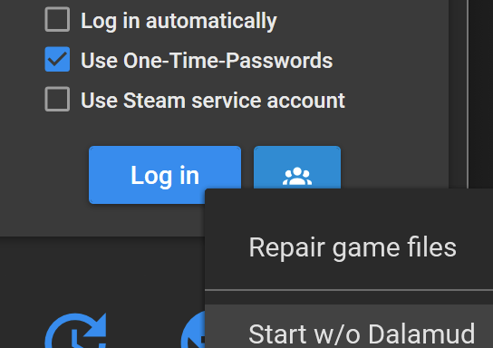

# Building Dalamud

:::tip

This guide covers building Dalamud from source, and is intended for people who
are making changes to Dalamud itself.

**If you're just looking to create plugins, you don't need to follow this
guide!** You can skip this section and head over to the
[Plugin Development](/category/plugin-development) section.

:::

Dalamud is built using [Nuke](https://nuke.build), a code-first build system for
C#/.NET projects. This guide will walk you through setting up your development
environment and building Dalamud.

## Prerequisites

- Windows 10/Windows Server 2016 or higher
- [Visual Studio 2022](https://visualstudio.microsoft.com/vs/)
  - Both the "Desktop Development with C++" and "Desktop Development with .NET"
    workloads are required.
- [.NET 7.0 SDK](https://dotnet.microsoft.com/download/dotnet/7.0)
  - This is included with Visual Studio 2022, but you can also install it
    separately if desired.
- [Git](https://git-scm.com/downloads)

## Getting the Source

Dalamud's source code is hosted on GitHub. You can clone the repository using
the following command:

```shell
git clone --recursive https://github.com/goatcorp/Dalamud.git
```

:::info

Dalamud has several Git submodules. If you don't clone the repository with the
`--recursive` flag, you'll need to initialize the submodules manually using the
following command:

```shell
git submodule update --init --recursive
```

You can also use this command later to update the submodules in your local
repository.

:::

## Building

In PowerShell, navigate to the root of the repository and run the following
command:

```pwsh
.\build.ps1
```

This will build the Nuke project and run the default target, which will build
Dalamud and all of its components (including the injector).

:::tip

You can also likely build Dalamud using MSBuild or your IDE's build system
directly. However, CI builds use Nuke, so if you run into any issues, you should
try building using Nuke to rule out build system issues.

:::

:::info

Building on other operating systems is not supported at this time, due to native
components (such as the injector) that rely on Windows APIs.

However, you may succeed with a _partial_ build on Linux/macOS by using
`./build.sh` instead of `.\build.ps1`, or by building the `Dalamud` project
directly with `dotnet build`.

:::

## Running

:::danger

If you use these instructions to bypass the disabling of Dalamud after game
patches, **you are on your own!**

We disable Dalamud on every patch until it is verified to work in a somewhat
stable and safe manner. If you choose to ignore this, you **will** experience
crashes and other issues, and we **will not** help you.

Once again: **manual injection of Dalamud into a running game is for developers
only!** If you want to help us test Dalamud and plugins after a patch, please
join the Discord and pick up the tester role. We will ping you when we need
help.

:::

The build process will output the injector to `bin\Debug\Dalamud.Injector.exe`.
For testing purposes, you can use this injector in a few different ways.

### Fake Launch

If you want to test Dalamud without fully logging into the game, you can use the
"fake launch" feature of the injector. This will launch the game, but without any
authentication, so you won't be able to go any further than the title screen.

To use this feature, you should ensure the game is not running, then run the
injector with the following arguments:

```shell
.\Dalamud.Injector.exe launch -f
```

:::caution

If your game is installed in a non-standard location, you must use the `-g`
argument to pass the full path to `ffxiv_dx11.exe`, e.g.:

```shell
.\Dalamud.Injector.exe launch -f -g "D:\dev\ffxiv\game-root\game\ffxiv_dx11.exe"
```

:::

### Manual Injection

To test Dalamud fully, you'll need to inject it into a running game. To do this,
you will need to ensure that you start the game in a method that disables its
ACL protections. Launching through the official launcher will not allow you to
inject Dalamud.

XIVLauncher is the recommended method for this, as it will automatically disable
the ACL protections for you. Simply launch the game through XIVLauncher, making
sure to disable Dalamud injection, using one of the following options:

- Right-click the "Log in" button, and select "Start w/o Dalamud".
  
- Disable Dalamud in the XIVLauncher settings.
  

Once the game is running, you can run the injector with the following arguments:

```shell
.\Dalamud.Injector.exe inject -a
```

Dalamud should now be injected into the game. You can verify this by looking for
the Dalamud logo in the top-left corner of the screen (assuming you haven't yet logged in).

:::tip

You can invoke the injector with `help` to see all available arguments:

```shell
.\Dalamud.Injector.exe help
```

Most of the extra arguments will not be helpful, but they are lightly documented
in the help output for completeness.

:::
